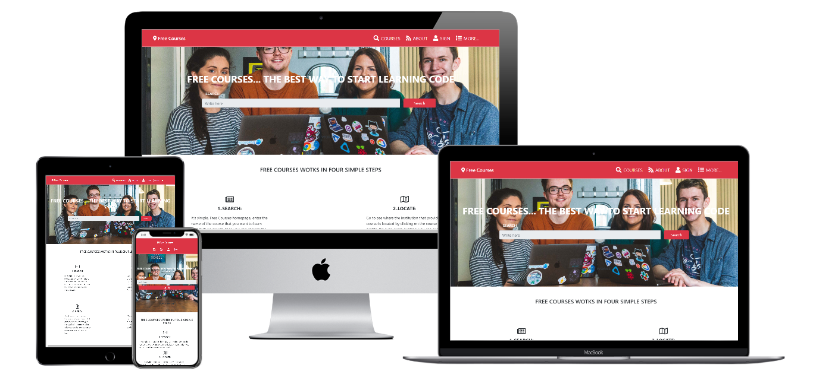
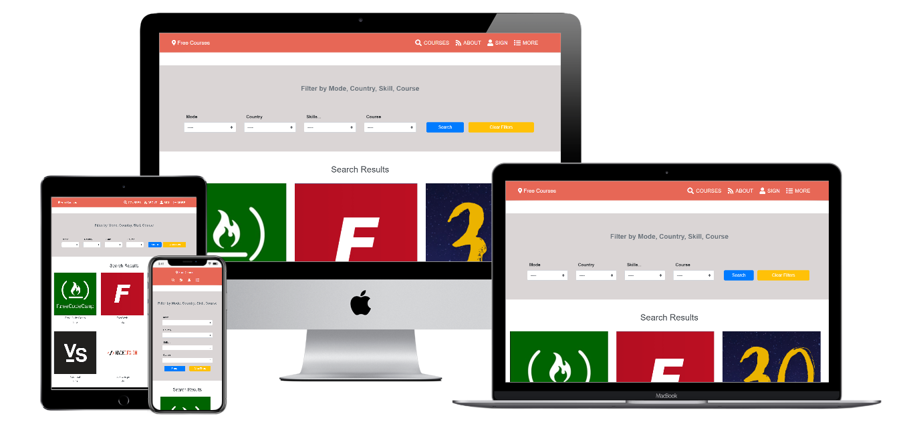
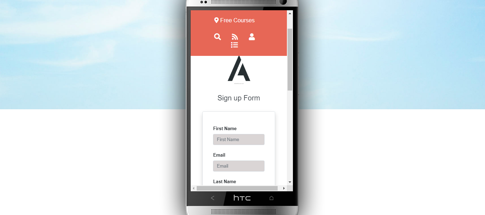
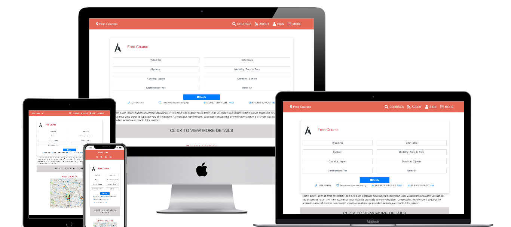

# Capstone project

> Capstone projects are solo projects at the end of the each of the Microverse Main Technical Curriculum sections. It is a real-world-like project built with business specifications This project was at the end of the HTML & CSS curriculum section. The minimum required pages for this project were: - the main page or search page, which links to the results page - the search results page, with a list of courses each with a link to the detail course page - the details of the project are in
the next link (https://www.behance.net/gallery/25563385/PatashuleKE)

## Homepage

## Search Page

## Sign up Page

## Course Information Page

## Built With

- HTML5 
- Fontawesome 
- Bootstrap (99% Bootstrap style)

## Live Demo

[Live Demo Link](https://rawcdn.githack.com/Alexoid1/Capstone-Project-HTML-CSS/67118296308fecf24b292ccc4c156306cbe61ec7/index.html)

## Video

[Video Link]()

## Getting Started

**Navigation bar**

- Go to (https://github.com/Alexoid1/Capstone-Project-HTML-CSS) and have a look around. 

### Prerequisites

- Browser
- Internet
- Download the code from repository (https://github.com/Alexoid1/Capstone-Project-HTML-CSS)

## Credit

- Design by Mather Njuguna and Sam Achola.
- See the Design Template on behance (https://www.behance.net/gallery/25563385/PatashuleKE)

## Authors

👤 **Pablo Alexis Zambrano Coral**

- Github: [@Alexoid1](https://github.com/Alexoid1)
- Twitter: [@pablo_acz](https://twitter.com/pablo_acz)
- Linkedin: [linkedin](https://www.linkedin.com/in/pablo-alexis-zambrano-coral-7a614a189/)

## 🤝 Contributing

Contributions, issues and feature requests and any type of feedback to improve are welcome!

## Show your support

Give a ⭐️ if you like this project!

## 📝 License

This project has no license.
