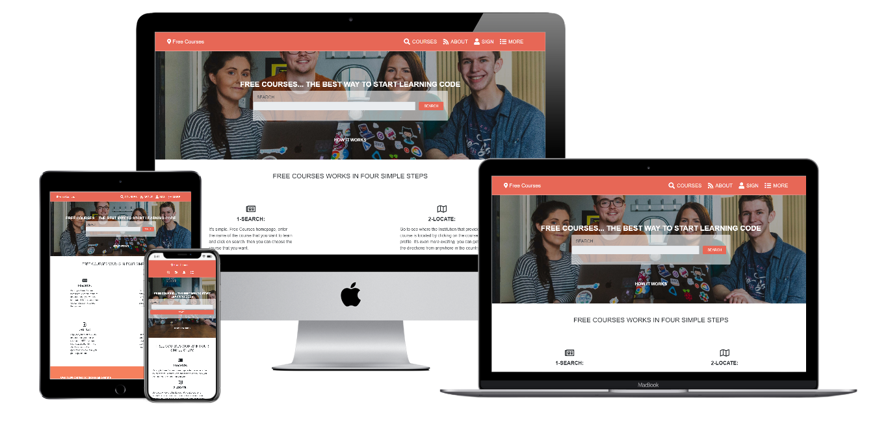

# Capstone project

> Capstone projects is the final project of HTML CSS module has to made a web site (https://www.behance.net/gallery/25563385/PatashuleKE)

## Homepage

## Search Page

## Sign up Page

## Course Information Page

## Built With

- HTML5 
- Fontawesome 
- Bootstrap (99% Bootstrap style)

## Live Demo

[Live Demo Link](https://rawcdn.githack.com/Alexoid1/Capstone-Project-HTML-CSS/d2e390660956cb818b103f5f780e67dd9bac1745/index.html)

## Video

[Video Link](https://rawcdn.githack.com/Alexoid1/Capstone-Project-HTML-CSS/dcd2b657139f57a90fad4374f322ce67750ed532/index.html)

## Credit

- Design by Mather Njuguna and Sam Achola.
- See the Design Template on behance (https://www.behance.net/gallery/25563385/PatashuleKE)

## Authors

👤 **Pablo Alexis Zambrano Coral**

- Github: [@Alexoid1](https://github.com/Alexoid1)
- Twitter: [@pablo_acz](https://twitter.com/pablo_acz)
- Linkedin: [linkedin](https://www.linkedin.com/in/pablo-alexis-zambrano-coral-7a614a189/)

## 🤝 Contributing

Contributions, issues and feature requests and any type of feedback to improve are welcome!

## Show your support

Give a ⭐️ if you like this project!

## 📝 License

This project has no license.
